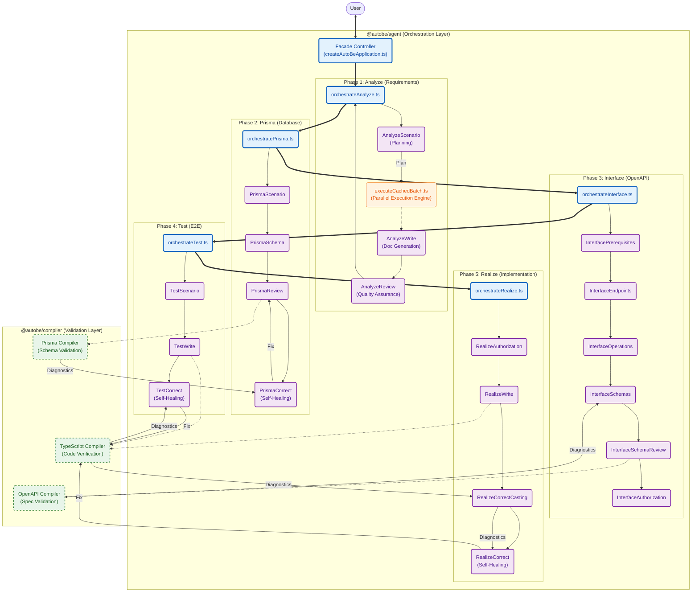

# AutoBE Workflow

```mermaid
flowchart TD
    %% ==============================================================================
    %% GLOBAL STYLES & DEFINITIONS
    %% ==============================================================================
    classDef orchestrator fill:#e3f2fd,stroke:#1565c0,stroke-width:3px,color:#0d47a1;
    classDef agent fill:#f3e5f5,stroke:#7b1fa2,stroke-width:2px,color:#4a148c;
    classDef compiler fill:#e8f5e9,stroke:#2e7d32,stroke-width:2px,color:#1b5e20,stroke-dasharray: 5 5;
    classDef util fill:#fff3e0,stroke:#ef6c00,stroke-width:1px,color:#e65100;

    User([User]) <==> Facade

    %% ==============================================================================
    %% PACKAGE: @autobe/agent
    %% ==============================================================================
    subgraph Agent_Package ["@autobe/agent (Orchestration Layer)"]
        direction TB
        
        Facade("Facade Controller<br/>(createAutoBeApplication.ts)"):::orchestrator
        BatchExec("executeCachedBatch.ts<br/>(Parallel Execution Engine)"):::util
        
        %% PHASE 1: ANALYZE
        subgraph Analyze ["Phase 1: Analyze (Requirements)"]
            direction TB
            An_Orch("orchestrateAnalyze.ts"):::orchestrator
            An_Scenario("AnalyzeScenario<br/>(Planning)"):::agent
            An_Write("AnalyzeWrite<br/>(Doc Generation)"):::agent
            An_Review("AnalyzeReview<br/>(Quality Assurance)"):::agent
            
            An_Orch --> An_Scenario
            An_Scenario --"Plan"--> BatchExec
            BatchExec -.-> An_Write
            An_Write --> An_Review
            An_Review --> An_Orch
        end

        %% PHASE 2: PRISMA
        subgraph Prisma ["Phase 2: Prisma (Database)"]
            direction TB
            Pr_Orch("orchestratePrisma.ts"):::orchestrator
            Pr_Scenario("PrismaScenario"):::agent
            Pr_Schema("PrismaSchema"):::agent
            Pr_Review("PrismaReview"):::agent
            Pr_Correct("PrismaCorrect<br/>(Self-Healing)"):::agent
            
            Pr_Orch --> Pr_Scenario
            Pr_Scenario --> Pr_Schema
            Pr_Schema --> Pr_Review
            Pr_Review --> Pr_Correct
        end

        %% PHASE 3: INTERFACE
        subgraph Interface ["Phase 3: Interface (OpenAPI)"]
            direction TB
            In_Orch("orchestrateInterface.ts"):::orchestrator
            In_Prereq("InterfacePrerequisites"):::agent
            In_Endpts("InterfaceEndpoints"):::agent
            In_Ops("InterfaceOperations"):::agent
            In_Schemas("InterfaceSchemas"):::agent
            In_Review("InterfaceSchemaReview"):::agent
            In_Auth("InterfaceAuthorization"):::agent
            
            In_Orch --> In_Prereq
            In_Prereq --> In_Endpts
            In_Endpts --> In_Ops
            In_Ops --> In_Schemas
            In_Schemas --> In_Review
            In_Review --> In_Auth
        end

        %% PHASE 4: TEST
        subgraph Test ["Phase 4: Test (E2E)"]
            direction TB
            Te_Orch("orchestrateTest.ts"):::orchestrator
            Te_Scenario("TestScenario"):::agent
            Te_Write("TestWrite"):::agent
            Te_Correct("TestCorrect<br/>(Self-Healing)"):::agent
            
            Te_Orch --> Te_Scenario
            Te_Scenario --> Te_Write
            Te_Write --> Te_Correct
        end

        %% PHASE 5: REALIZE
        subgraph Realize ["Phase 5: Realize (Implementation)"]
            direction TB
            Re_Orch("orchestrateRealize.ts"):::orchestrator
            Re_Auth("RealizeAuthorization"):::agent
            Re_Write("RealizeWrite"):::agent
            Re_Cast("RealizeCorrectCasting"):::agent
            Re_Correct("RealizeCorrect<br/>(Self-Healing)"):::agent
            
            Re_Orch --> Re_Auth
            Re_Auth --> Re_Write
            Re_Write --> Re_Cast
            Re_Cast --> Re_Correct
        end

        %% Orchestrator Flow
        Facade ==> An_Orch
        An_Orch ==> Pr_Orch
        Pr_Orch ==> In_Orch
        In_Orch ==> Te_Orch
        Te_Orch ==> Re_Orch
    end

    %% ==============================================================================
    %% PACKAGE: @autobe/compiler
    %% ==============================================================================
    subgraph Compiler_Package ["@autobe/compiler (Validation Layer)"]
        direction TB
        Comp_Prisma("Prisma Compiler<br/>(Schema Validation)"):::compiler
        Comp_OpenAPI("OpenAPI Compiler<br/>(Spec Validation)"):::compiler
        Comp_TS("TypeScript Compiler<br/>(Code Verification)"):::compiler
    end

    %% ==============================================================================
    %% COMPILER INTERACTIONS (FEEDBACK LOOPS)
    %% ==============================================================================
    
    %% Prisma Loop
    Pr_Review -.-> Comp_Prisma
    Comp_Prisma --"Diagnostics"--> Pr_Correct
    Pr_Correct --"Fix"--> Pr_Review

    %% Interface Loop
    In_Review -.-> Comp_OpenAPI
    Comp_OpenAPI --"Diagnostics"--> In_Schemas 
    
    %% Test Loop
    Te_Write -.-> Comp_TS
    Comp_TS --"Diagnostics"--> Te_Correct
    Te_Correct --"Fix"--> Comp_TS

    %% Realize Loop
    Re_Write -.-> Comp_TS
    Comp_TS --"Diagnostics"--> Re_Cast
    Re_Cast --"Diagnostics"--> Re_Correct
    Re_Correct --"Fix"--> Comp_TS
```